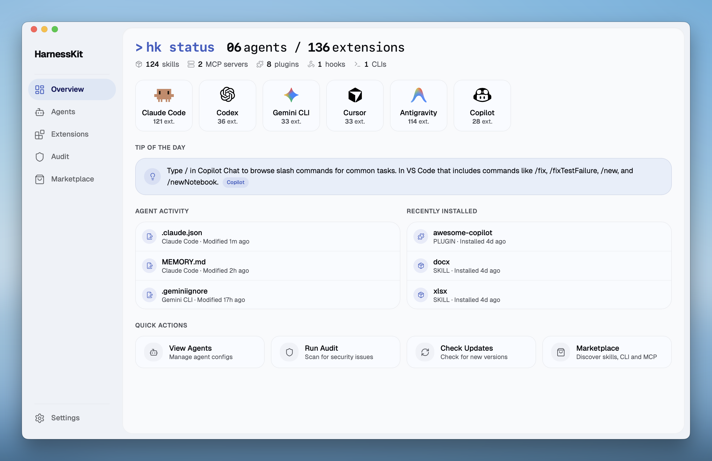

<p align="center">
  
</p>

<h1 align="center">HarnessKit 中文版</h1>

<p align="center">
  <strong>所有 AI Agent 的统一管理中心</strong><br/>
  免费开源 —— 一站式管理所有 AI 编程助手：桌面端、CLI、Web 全覆盖
</p>

<p align="center">
  <a href="https://github.com/RealZST/HarnessKit">原版英文 README (English)</a>
</p>

<p align="center">
  <a href="#为什么选择-harnesskit">为什么选择</a>&nbsp;&nbsp;•&nbsp;&nbsp;<a href="#核心功能">核心功能</a>&nbsp;&nbsp;•&nbsp;&nbsp;<a href="#快速开始">快速开始</a>&nbsp;&nbsp;•&nbsp;&nbsp;<a href="#开发路线图">路线图</a>
</p>

<br/>

<p align="center">
  
</p>

<br/>

## 为什么选择 HarnessKit？

每个 Agent 都有自己的世界。扩展、配置、记忆、规则 —— 散落在不同的目录、不同的格式、不同的规范中。

**HarnessKit 把它们全部统一管理** —— 从一个界面查看、保护和管理所有 Agent 的一切。

<p align="center">
  
</p>

---

## 核心功能

### 🧩 全类型扩展管理

HarnessKit 统一管理 **五种扩展类型** —— **技能 (Skills)**、**MCP 服务器**、**插件 (Plugins)**、**钩子 (Hooks)** 和 **Agent-first CLI 工具**。

<div align="center">

| Agent | 技能 | MCP | 插件 | 钩子 | Agent-first CLI |
|:---|:---:|:---:|:---:|:---:|:---:|
| **Claude Code** | ✓ | ✓ | ✓ | ✓ | ✓ |
| **Codex** | ✓ | ✓ | ✓ | ✓ | ✓ |
| **Gemini CLI** | ✓ | ✓ | ✓ | ✓ | ✓ |
| **Cursor** | ✓ | ✓ | ✓ | ✓ | ✓ |
| **Antigravity** | ✓ | ✓ | — | — | ✓ |
| **Copilot** | ✓ | ✓ | ✓ | ✓ | ✓ |
| **Hermes** | ✓ | ✓ | — | ✓ | ✓ |
| **OpenClaw** | ✓ | ✓ | ✓ | — | ✓ |

<small><i>* "—" 表示该 Agent 暂不支持此扩展类型。</i></small>

</div>

- **智能分类** —— 按*类型*、*Agent* 或*来源*筛选，按名称搜索。同一仓库的扩展自动归类为*扩展包*，支持批量管理。
- **全透明可见** —— 每个扩展一目了然：所属 Agent、权限、信任评分、运行状态。打开详情面板可查看*文件路径*、*目录结构*和*审计发现*。
- **轻松管理** —— 列表中直接启用/禁用。一键检查所有扩展的更新。
- **跨 Agent 部署** —— 查看哪些 Agent 已安装、哪些未安装 —— 一键部署到缺失的 Agent。HarnessKit 自动处理各 Agent 之间的格式差异（JSON、TOML、钩子规范、MCP schema）。

---

### 🤖 Agent 配置、记忆与规则

HarnessKit 统一管理所有 Agent 的 **配置文件**、**记忆**、**规则** 和 **忽略文件**。目前支持 **8 个 Agent**：Claude Code、Codex、Gemini CLI、Cursor、Antigravity、Copilot、**Hermes**、**OpenClaw**。

- **配置文件追踪** —— 自动发现每个 Agent 的配置文件 —— 包括全局和项目级。添加项目目录或自定义路径后，HarnessKit 会自动识别。
- **独立 Agent 面板** —— 每个 Agent 有专属页面，文件按类别整理，显示作用域、路径、文件大小和已安装扩展摘要。展开任意文件可直接预览内容。
- **自定义路径** —— 可为任何 Agent 面板添加任意文件或文件夹用于追踪，适用于自定义配置或脚本。
- **实时检测** —— 配置文件一旦修改，面板立即反映变化。

---

### 🛡️ 安全审计与权限透明

内置安全引擎对所有扩展执行 **18 项静态分析规则**，并给出 **信任评分**（0-100），分为三档 —— **安全**（80+）、**低风险**（60-79）、**需审查**（60 以下）。专属审计页面支持搜索、按等级筛选、深入查看每项发现。

- **一键审计** —— 一键对所有扩展执行完整安全扫描。仪表盘显示已扫描数量和上次审计时间。
- **精确定位** —— 每项发现精确到具体文件和行号，可立即追溯问题。
- **逐 Agent 扫描** —— 即使多个 Agent 共享同一扩展，每个副本独立审计 —— 因为版本可能漂移，一个 Agent 上的安全副本不代表另一个也安全。
- **权限透明** —— 每个扩展的权限通过五个维度展示 —— 文件系统路径、网络域名、Shell 命令、数据库引擎和环境变量。

---

### 🏪 市场生态

发现、评估、安装 —— 三个市场合一，每个都有热门排行和搜索：

- **技能** —— 浏览并安装来自 [skills.sh](https://skills.sh) 注册表的技能。也支持从 **Git URL** 或**本地目录**安装。
- **MCP 服务器** —— 浏览 [Smithery](https://smithery.ai) 的 MCP 服务器注册表。
- **Agent-first CLI** —— 发现专为 Agent 构建的 CLI 工具 —— Agent 扩展生态的最新前沿。

---

### 📂 原地管理

HarnessKit 直接操作 Agent 的原生目录 —— 不创建影子副本，无同步冲突。

- **原生目录** —— 直接读写每个 Agent 自己的配置目录，文件保持在原位。
- **非破坏性操作** —— 启用/禁用扩展仅重命名文件，不移动或复制。
- **零锁定** —— 卸载 HarnessKit 后一切恢复原样，无需迁移或清理。

---

### ⌨️ CLI 支持

HarnessKit 提供独立的命令行界面（`hk`），适用于终端优先的工作流，支持 **macOS**、**Linux** 和 **Windows**：

```shell
$ hk status
  Agents        8 detected (claude · codex · gemini · cursor · antigravity · copilot · hermes · openclaw)
  Extensions    136 total (124 skills · 2 mcp · 8 plugins · 1 hooks · 1 clis)

$ hk list --kind skill --agent claude    # 按类型和 Agent 筛选
$ hk audit                               # 安全审计 + 信任评分
$ hk enable my-skill                     # 启用技能
$ hk disable --pack owner/repo           # 按来源批量禁用
```

---

### 🌐 Web 模式

与桌面应用完全相同的 UI，也可以作为 **Web 界面** 运行 —— 直接从 `hk` CLI 二进制提供服务。无需额外依赖，无需单独安装。

```shell
$ hk serve
HarnessKit Web UI running at http://127.0.0.1:7070
```

这使得 HarnessKit 可以在 **Linux 服务器**、**HPC 集群**或任何**无头设备**上使用。Web 模式与桌面应用**功能完全一致**。

---

### ✨ 贴心的交互体验

- 💡 **每日提示** —— 概览仪表盘针对检测到的每个 Agent 推送实用技巧
- 📊 **动态活动流** —— Agent 活动和最近安装时间线实时捕获配置变更、扩展安装和 Agent 事件
- ⚡ **快捷操作** —— 一键查看 Agent、运行审计、检查更新、访问市场
- 🎨 **多主题** —— 支持浅色、深色和系统跟随

---

## 快速开始

**前提条件：** 至少安装一个支持的 AI 编程 Agent。

### 🖥️ 桌面应用 (macOS)

1. 从 [最新 Release](https://github.com/RealZST/HarnessKit/releases/latest) 下载 DMG
2. 打开 DMG，将 **HarnessKit** 拖入 Applications 文件夹
3. 启动 HarnessKit，它会自动检测已安装的 Agent 并扫描扩展

### 🌐 Web 模式 (macOS / Linux / Windows)

**本地安装：**

```bash
# macOS / Linux
curl -fsSL https://raw.githubusercontent.com/RealZST/HarnessKit/main/install.sh | sh

# Windows (PowerShell)
irm https://raw.githubusercontent.com/RealZST/HarnessKit/main/install.ps1 | iex
```

**启动 Web 界面：**

```bash
hk serve
```

然后浏览器打开 `http://localhost:7070`。

**远程服务器：**

```bash
ssh -L 7070:localhost:7070 user@your-server
hk serve
```

保持 SSH 会话运行即可。

---

## 开发路线图

- 🤖 **更多 Agent** —— OpenCode 等更多 Agent 支持
- 📦 **扩展迁移** —— 设备间导出/导入扩展配置
- ⌨️ **CLI 增强** —— 更多命令和更丰富的功能
- 🌐 **完整国际化** —— 更多语言支持

---

## 参与贡献

欢迎贡献！详见 [CONTRIBUTING.md](CONTRIBUTING.md)（英文）。

---

## 许可证

本项目基于 [Apache-2.0](LICENSE) 许可证开源。

图标素材（`public/icons/` 和 `src/components/shared/agent-mascot/`）为 **保留所有权利**，不在 Apache-2.0 许可证覆盖范围内。

所有产品名称、徽标和商标均为其各自所有者的财产。HarnessKit 是独立项目，不与任何 Agent 厂商存在隶属或合作关系。
